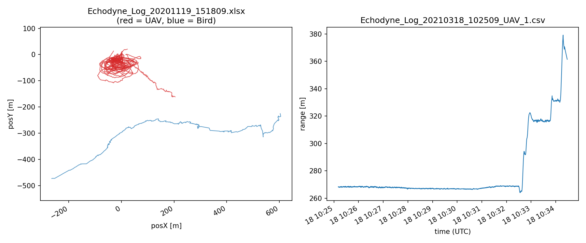

# UAV vs. Bird Radar Tracks Dataset

A dataset of real-world radar tracks of small UAVs (drones), birds, humans, and
ground vehicles, collected with the Echodyne EchoGuard (MESA) radar during
eight field trials in Quebec, Canada, between October 2019 and March 2021.

The dataset was collected to support research on the **detection and
classification of small UAVs versus other airborne targets (especially
birds)** using kinematic track information — a key problem for counter-UAS and
airspace-safety systems, particularly at ranges beyond which micro-Doppler
signatures are available.

## Highlights

- **Real field data** from 8 trials over 3 sites and multiple seasons/weather conditions.
- **1,117 expert-labeled tracks** (UAV, bird, human, vehicle, mixed) plus three full raw
  radar log files containing thousands of additional unlabeled tracks.
- Track updates at **10 Hz** with 3D position, 3D velocity, azimuth/elevation/range, and RCS.
- Target UAVs: DJI Phantom 2, Phantom 4, Inspire, and Mavic, flown at ranges of
  **100 m – 1,200 m** and altitudes of roughly 9 m – 36 m, without payloads.
- Scenarios include complex 3D maneuvers, UAVs mimicking bird flight, UAVs
  approaching from behind the radar, and two UAVs flying simultaneously.
- Ground truth annotated by experts with the help of a co-located PTZ camera
  (Bosch HD, color + low-light).



## Data organization

Data is organized by field trial in `data/Demo-0` … `data/Demo-7`:

| Folder | Date(s) | Location | Contents | Format |
|--------|---------|----------|----------|--------|
| `Demo-0` | 2019-10-11 → 10-13 | Alma, QC | 29 recording sessions from two radar units (`-R1`/`-R2` filename suffix); 946 labeled tracks (UAV, bird, human, vehicle, mixed) | Annotated `.xlsx` |
| `Demo-1` | 2020-11-09 | Laval, QC | 2 curated UAV track extracts (`DRONE_Id_<trackID>.csv`) | Raw-log CSV (`;`-delimited) |
| `Demo-2` | 2020-11-19 | Laval, QC | 2 sessions; 21 labeled tracks (UAV, bird) | Annotated `.xlsx` |
| `Demo-3` | 2020-12-18 | Laval, QC | 4 sessions; 23 labeled tracks (UAV, bird, human, vehicle) | Annotated `.xlsx` |
| `Demo-4` | 2021-02-26 | Laval, QC | 3 **full raw radar logs** (~1.27 M rows, ~8,000 radar tracks, gzip-compressed) + 8 curated UAV/truck track extracts | Raw-log CSV |
| `Demo-5` | 2021-03-10 | Laval, QC | 2 sessions; 4 labeled UAV tracks | Annotated `.xlsx` |
| `Demo-6` | 2021-03-18 | Laval, QC | 10 sessions; 88 labeled tracks (UAV, bird, human) | Annotated `.xlsx` |
| `Demo-7` | 2020-11 → 2021-03 | Laval, QC | Consolidated collection of 21 curated single-UAV track extracts spanning trials 1–6 | Raw-log CSV |

A complete per-file listing (rows, sizes, labeled-track counts) is in
[`metadata/file_manifest.csv`](metadata/file_manifest.csv), and every labeled
track is indexed in [`metadata/track_labels.csv`](metadata/track_labels.csv).

### Labeled track summary

| Class | Tracks |
|---------|-----:|
| BIRD | 492 |
| MIXED (birds/people/cars, unresolved) | 376 |
| UAV | 167 |
| HUMAN | 65 |
| VEHICLE | 14 |
| UNKNOWN | 3 |
| **Total** | **1,117** |

In addition, the three raw logs in `Demo-4` contain ~8,000 radar-initiated
tracks (mostly clutter/unknown) that carry the radar's own real-time
classification but no manual ground truth — useful for studying detection,
track management, and clutter rejection.

## File formats

Two file formats are used; both are described column-by-column in
[`docs/DATA_DICTIONARY.md`](docs/DATA_DICTIONARY.md).

**1. Annotated Excel workbooks (`.xlsx`)** — post-processed recordings with 11
columns per track update (`SystemTrackID`, `azimuth`, `elevation`, `range`,
`posX/Y/Z`, `veloX/Y/Z`, `rcs`). Each workbook has a second sheet
(`Sheet1`) mapping every `SystemTrackID` to its expert ground-truth label.

**2. Raw radar log CSVs (`.csv` / `.csv.gz`)** — the full ~40-column Echodyne
system log, including timestamps, track life-cycle fields, association
statistics, and the radar's own classification probabilities (`probUav`,
`UpdatedTrackType`). Files named `*_UAV_<id>.csv`, `*_TRUCK_<id>.csv`, or
`DRONE_Id_<id>.csv` are curated extracts of individual tracks whose true class
(from ground-truth observation) is given in the file name.

> **Notes**
> - The three large raw logs in `Demo-4` are gzip-compressed to stay within
>   GitHub file-size limits. `pandas.read_csv()` reads them directly; or
>   decompress with `gunzip <file>.csv.gz`.
> - The two files in `Demo-1` are semicolon-delimited; all other CSVs are
>   comma-delimited.
> - `Demo-7` is a convenience collection: 9 of its 21 files also appear next
>   to their parent raw logs in `Demo-1`/`Demo-4` (identical copies).
> - Raw-label spellings vary slightly in the annotation sheets (e.g. `BURD`,
>   `PEOPLE`, `Human/dog`); `metadata/track_labels.csv` provides both the raw
>   and a normalized label for every track.
> - `LogDate` in raw logs is `DD/MM/YYYY`; `timeStamp` is ISO 8601 UTC.
> - `rcs` is occasionally `NaN` when no measurement was associated on that update.

## Quick start

```python
import pandas as pd

# A labeled recording session (track data + labels)
tracks = pd.read_excel("data/Demo-2/Echodyne_Log_20201119_151809.xlsx", sheet_name=0)
labels = pd.read_excel("data/Demo-2/Echodyne_Log_20201119_151809.xlsx", sheet_name=1)

# A compressed raw radar log (read directly, no need to decompress)
raw = pd.read_csv("data/Demo-4/Echodyne_Log_20210226_142133.csv.gz")

# The consolidated label index for the whole dataset
all_labels = pd.read_csv("metadata/track_labels.csv")
print(all_labels["label"].value_counts())
```

See [`examples/load_tracks.py`](examples/load_tracks.py) for a fuller example
that reconstructs and plots individual 3D trajectories.

## Sensor and collection setup

- **Radar:** Echodyne EchoGuard (MESA — Metamaterial Electronically Scanning Array),
  K-band, tripod-mounted; track updates logged at 10 Hz. Trial `Demo-0` used two
  radar units simultaneously (`R1`, `R2`).
- **Ground truth:** co-located Bosch HD PTZ camera (color + low-light) used by
  operators to visually confirm and annotate each track.
- **Coordinate conventions:** `azimuth`/`elevation` in degrees and `range` in
  meters, relative to the radar; `posX/posY/posZ` in meters and
  `veloX/veloY/veloZ` in m/s in the radar's local Cartesian frame; `rcs` in dBsm.

## Copyright

© His Majesty the King in Right of Canada, as represented by the National Research Council of Canada, 2026 \
© Sa Majesté le Roi du chef du Canada, représenté par le Conseil national de recherches du Canada, 2026

## License

This dataset is released under the
[Creative Commons Attribution 4.0 International (CC BY 4.0)](https://creativecommons.org/licenses/by/4.0/)
license — see [`LICENSE`](LICENSE).

## Citation

If you use this dataset in your research, please cite it (see
[`CITATION.cff`](CITATION.cff)):

> Mehta, V., Bolic, M., Mantegh, I., & Vidal, C. *UAV vs. Bird Radar Tracks
> Dataset* (2019–2021). National Research Council Canada / University of Ottawa.

A journal article describing classification methods developed with this data
is in preparation; this section will be updated with the reference once published.

## Contributors

- **Varun Mehta**, **Iraj Mantegh**, **Charles Vidal** — National Research Council Canada (NRC)
- **Miodrag Bolic** — School of Electrical Engineering and Computer Science,
  University of Ottawa

Data collection was carried out by the National Research Council Canada during counter-UAS field trials in Quebec, Canada.

## Contact

For questions about the dataset, please open a GitHub [issue](https://github.com/nrc-cnrc/CUAS-sensing-dataset/issues) or contact the
contributors listed above.
